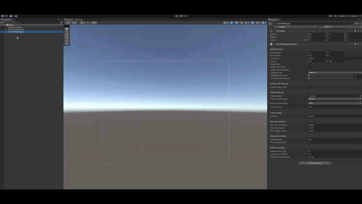

# Body

> Body is a simulated continuum composed of a group of particles. A body has attributes such as shape, center and material. Body corresponds to the EBody class in the code.

## How to Use Body GameObject

## Parameter Panel

The parameter panel for Body consists of three sections: Body Settings, Material Settings, and Color Settings.

### Body Settings

- Shape
  - The initial shape of the Body. Depending on the specific shape, Soft2D will automatically sample and generate particles inside it. Currently, it supports several types: box, circle, ellipse, capsule, and polygon.
  - For detailed documentation on shapes, see: [Shape.md](../Concepts/Shape.md)
- Linear Velocity
  - The initial linear velocity of the Body, measured in m/s.
- Angular Velocity
  - The initial angular velocity of the Body, measured in s^-1.
- Life Cycle
  - The duration from the generation to the automatical destruction of the Body. Measured in seconds. A value less than or equal to 0 means it will never be automatically destroyed.

### Material Settings

[Detailed Content](../Concepts/Material.md)

### Color Settings

- Base Color
  - The color given to the particles inside the Body.
- Randomize Color
  - Randomly generated color for the particles inside the Body.

## Built-in Functions

[Detailed Content]()

# Other Types of Body

## CustomBody

CustomBody is a Body where the user specifies the sampling points. It corresponds to the ECustomBody class in the code.

### How to Use CustomBody GameObject

### Parameter Panel

- Particle Local Space Position
  - The position of particles inside the CustomBody in local space.

## MeshBody

MeshBody is a Body with a topological relationship. Each vertex position in the input mesh generates a Soft2D particle, and they follow the topological relationship of the triangles inside the mesh. It corresponds to the EMeshBody class in the code.

### How to Use MeshBody GameObject

### Parameter Panel

- Mesh
  - The mesh corresponding to the MeshBody.
- Mesh Scale
  - The scaling factor for generating the MeshBody from the mesh.