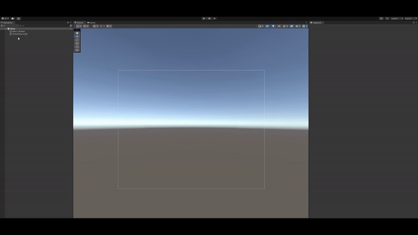

# Soft2DManager

> Soft2DManager 是用来控制并渲染当前场景的 Soft2D 粒子的脚本。你只有在场景里放置一个 Soft2DManager 才能使用 Soft2D 的相关功能。对应代码中的 Soft2DManager 类型。

## 使用 Soft2DManager GameObject 的方法

## 参数面板

Soft2DManager 的参数面板分为渲染设置， World 设置，测试工具设置，最大值设置，分辨率设置和碰撞设置六个部分。

### World 设置

> World 是一个容器，它包含一个场景中与模拟相关的所有物体，并按照物理规则对这些物体进行物理模拟。

- 世界区域大小
  - Soft2D 模拟的区域大小。
- 世界偏移坐标
  - Soft2D 模拟区域的位置，其中坐标为模拟区域左下角的坐标。
- 重力
  - Soft2D 重力的大小和方向。仅在关闭陀螺仪后有效。
- 陀螺仪
  - 是否打开陀螺仪。
- 陀螺仪重力
  - 开启陀螺仪后 Soft2D 重力的大小。仅在开启陀螺仪后有效。
- 力场
  - 是否开启力场。开启后，用户可以通过手指或鼠标在某个区域滑动，产生一个方向的力，影响粒子的运动方向和速度。
- 力场大小
  - 力场内力的大小。仅在开启力场后有效。
- 世界边界
  - 是否开启边界。开启后，Soft2DManager会自动在模拟范围的边界生成 Collider 阻止粒子超过模拟范围。

### 测试工具设置

- 开启测试工具
  - 是否开启测试工具。开启后，当用户运行场景时，Soft2DManager 会生成一个 Quad 动态显示碰撞体和触发器在 Soft2D 的位置。
- 碰撞体颜色
  - 碰撞体在测试工具上显示的颜色。
- 触发器颜色
  - 触发器在测试工具上显示的颜色。

### 渲染设置

- 粒子网格模型
  - 当前单个 Soft2D 粒子的模型。
- 粒子渲染层级
  - Soft2D 粒子的渲染层级。
- 粒子渲染模式
  - 单个 Soft2D 粒子的渲染材质。我们为用户编写了三种类型的材质，但用户也可以自己编写着色器渲染粒子。我们目前支持以下几种渲染模式：
  - **Unlit** ：只显示颜色，没有光照和其它因素；
  - **Blinn-Phong**：根据 Blinn-Phong 公式制作的简单光照模型，仅支持 URP 管线；
  - **PBR**：根据 PBR 制作的简单物理渲染模型，仅支持 URP 管线；
  - **Custom**：用户自定义的材质，可以[在这里](../Advance/CustomShader.md)看到相关教程。

### 时间设置

- 时间步长
  - Soft2D 模拟的时间步长。
- 时间子步长
  - 当前时间步长的内部时间子步长。

### 最大值设置

- 最大粒子数量
  - 当前场景允许的最大粒子数量。
- 最大 Body 数量
  - 当前场景允许的最大 Body 数量。
- 最大 Trigger 数量
  - 当前场景允许的最大触发器数量。

### 分辨率设置

- 网格分辨率：Soft2D 提供的网格的分辨率大小（如测试工具的网格）。
- 精确网格分辨率：Soft2D 提供的精确网格的分辨率大小。

### 碰撞设置

- 法线碰撞力度：Soft2D 粒子沿着法线方向的碰撞衰减力度。
- 速度碰撞力度：Soft2D 粒子沿着速度方向的碰撞衰减力度。
- MeshBody 力度：MeshBody 的碰撞力度。

## FAQ

如何在一个大规模的世界中模拟很小的物体？

- Soft2D 中，body中粒子的采样密度会根据世界的大小来自动调整，更大的世界会导致更稀疏的粒子采样。因此，在一个较大的世界中可能没有足够的精度来模拟非常小的物体。

是否可以为不同的粒子设置不同的渲染材质。

- 目前粒子通过`Graphics.DrawMeshInstancedIndirect`方法绘制，暂时不支持为不同的粒子设置不同的材质。
